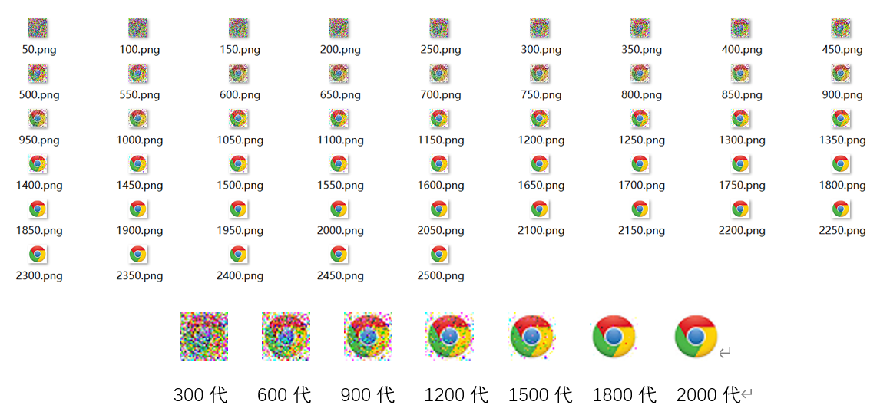

# AI-master

#### 介绍
使用群智能算法中的遗传算法实现图像拟合。

#### 1.染色体编码方式
遗传算法中染色体编码方式和适应度的计算方式决定了整个算法的最优效果，修改其他的参数只能不断地逼近这个最有效果，因此编码方式至关重要。

由于我们的目标是使用遗传算法来进行图像拟合，所以我们采用图像的每个像素块的值来对图像进行编码。由于图像为彩色的，每个彩色像素又由r, g, b三原色构成，因此每个基因又包括（r, g, b）三个碱基。即一个个体含有N个基因，每个基因包括r, g, b三个碱基，其中N为图像的像素值，每个碱基的取值范围为(0, 255)。

#### 2.选择策略
要想选出适应种群的个体，我们首先要量化个体对环境的适应能力，即评价适应度。
#### 2.1 改进前
改进前的适应度函数计算是通过计算当前基因每个碱基与目标基因的碱基之间差的绝对值，再将其归一化到（0，1）之间。即每个基因的r, g, b值与目标基因的r, g, b值之差的绝对值乘以3个碱基之和与目标的差值作为count。再将count求平均值得到avg_total, 将count/avg_total 作为最终每个个体的适应度。

但是经过实验与分析之后发现该计算方法有很多问题，并且效果较差。由于个体与个体之间适应度的差异极小，在选择过程中优势个体很难保存下来，导致即使可能会出现良好的个体，也很容易被淘汰或者变异掉，导致最终很难收敛。而且由于适应度的计算较为复杂，在迭代过程中每次都需要进行计算，因此算法的速度很低。

而且有一个致命的问题是由于乘上了tsum-sum，导致当图像即使没有和目标完全一样，也有可能出现count为0的情况（比如说目标的r,g,b值分别为100，100，100而当前个体的r,g,b值为90，100，110），从而导致avgcount为0，从而导致算法异常终止，永远无法与目标图像完美拟合。

#### 2.2 改进后

分析了算法的问题之后，我们决定去掉不必要的归一化部分，直接将当前个体基因与目标个体基因差的绝对值左右适应度。
 
修改之后的评价函数不仅扩大了个体之间的差异，增加了优势个体保存下来的机会，而减少了计算的复杂度，使得算法迭代的速度大大加快。更重要的是解决了还未达到目标图像就出现适应度为0的情况。

计算之后我们根据适应度来对个体进行排序，选择适应度最好的前100个个体来作为下一代的种群。

#### 3.交叉策略
交叉是为了获得更多的基因型，使得出现更多优秀的个体。我们对两个个体进行交叉的方式为单点交叉，即选择一个点，然后交换两个点左右的基因。注意此处需要使用深克隆，而不能使用浅克隆，防止出现克隆地址而导致最终结果混乱。
 
同时还需要选择出交叉的两个个体，我们使用的方法是根据种群的规模来确定一个seek值，然后将（0，seek）与（seek+1, N）之间的个体进行交叉。

#### 4.变异策略

交叉只能获得种群已有的基因，而无法获得不存在的基因，因此还需要进行变异。变异可以为种群提供多种多样的基因，从而可能出现更好地适应环境的个体。

由于在变异过程中有可能会出现将适应环境的个体变成不适应环境的个体，从而导致一些已经与目标完全一样的像素块丢失，我们在变异前还进行了一定的保护措施，使得优秀个体能够有更大的可能性将其优秀基因遗传下去。

我们在变异前先检查个体基因的r, g, b值与目标的r, g, b值是否相同，如果相同则不对该碱基进行变异，否则产生一个0-255的随机值代替原来的碱基值。

#### 5.结果展示
拟合图像

结果图像

进化曲线

